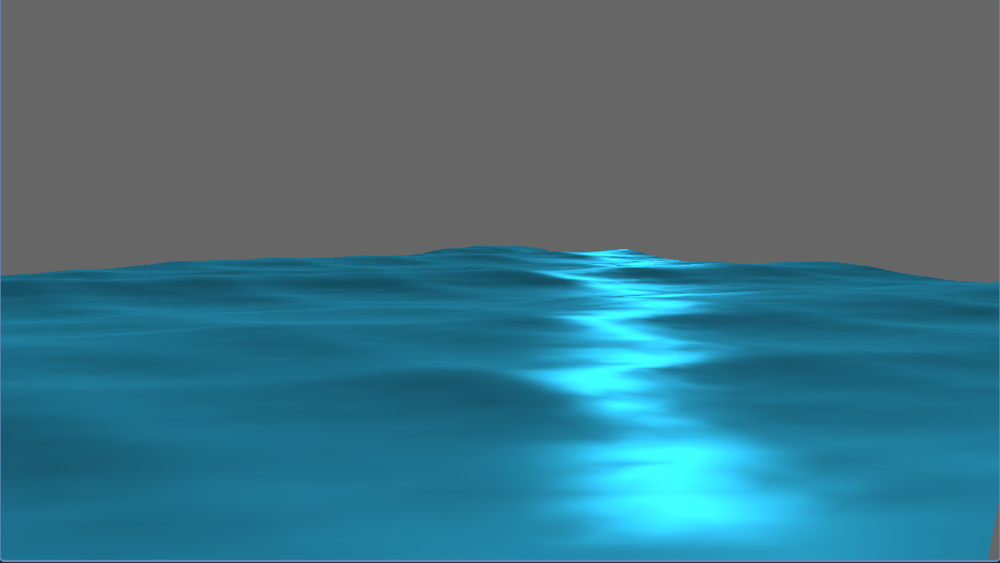
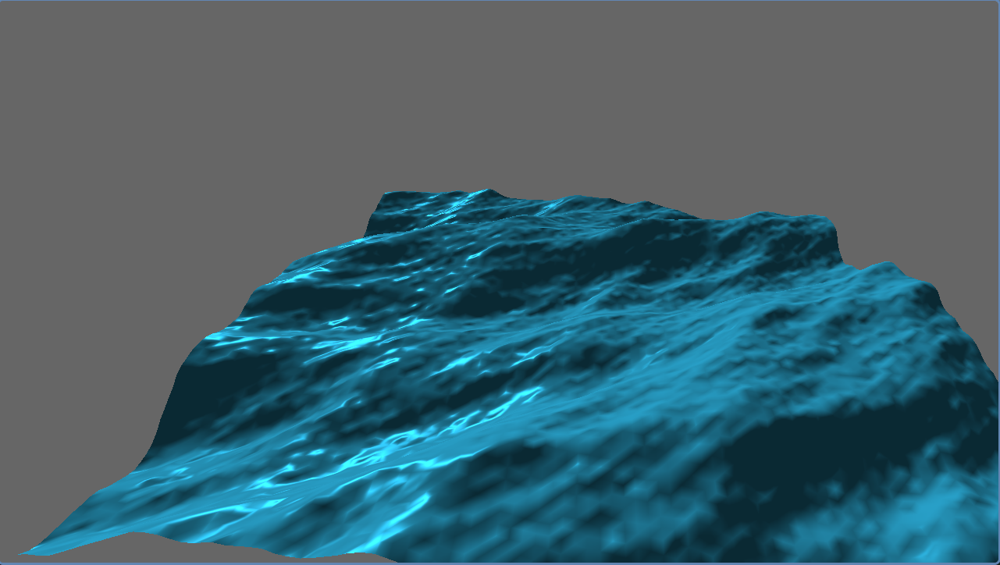

# Fake water

An attempt at making a fluid looking visual simulation using wave functions and fractional brownian motion. Lighting uses lambertian diffuse and blinn phong specular models.

## 📷 Screenshots



## 🌟 Features
* **Modern C++ Architecture:** Clean, object-oriented design using modern C++ standards.
* Procedural wave generation
* **CMake Build System:** Easy to compile and build across multiple platforms (Windows, Linux, macOS).
* **Resource Management:** Modular structure for handling 3D models, textures, and rendering configurations.

## 🛠️ Prerequisites

Before you begin, ensure you have the following installed on your machine:
* A C++17 (or newer) compatible compiler (GCC, Clang, or MSVC)
* [CMake](https://cmake.org/download/) (version 3.10 or higher)
* [Git](https://git-scm.com/)

## 🚀 Building the Project

This project uses CMake for building. Follow these steps to build and run the renderer locally:

### 1. Clone the repository
```bash
git clone [https://github.com/yashchaurasia667/fake-water.git](https://github.com/yashchaurasia667/fake-water.git)
cd fake-water
```

### 2. Generate Build Files
Create a build directory and run CMake:
```bash
mkdir build
cd build
cmake ..
```

### 3. Compile the Project
```bash
cmake --build .
make
```

### 4. Run the Renderer
After a successful build, the executable will be located in the `build` directory.
```bash
# On Linux/macOS
./fake-water

# On Windows
./fake-water.exe
```
